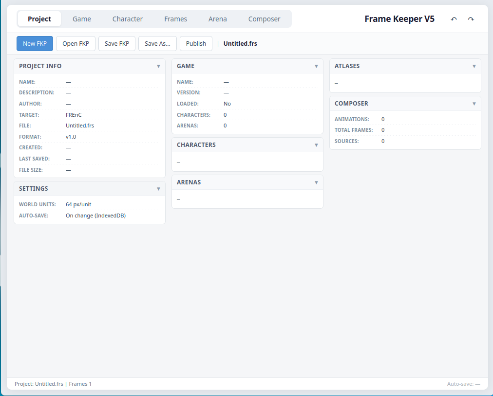
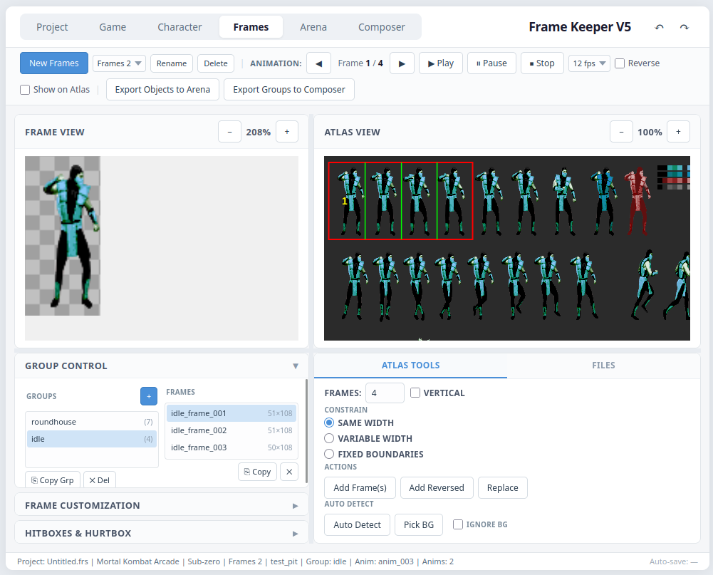
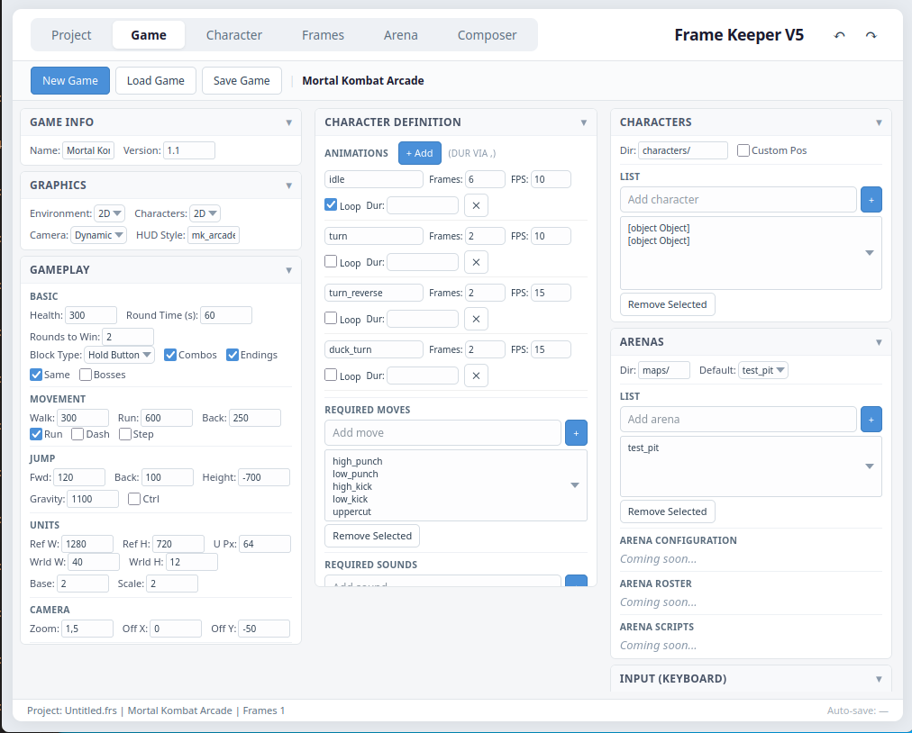
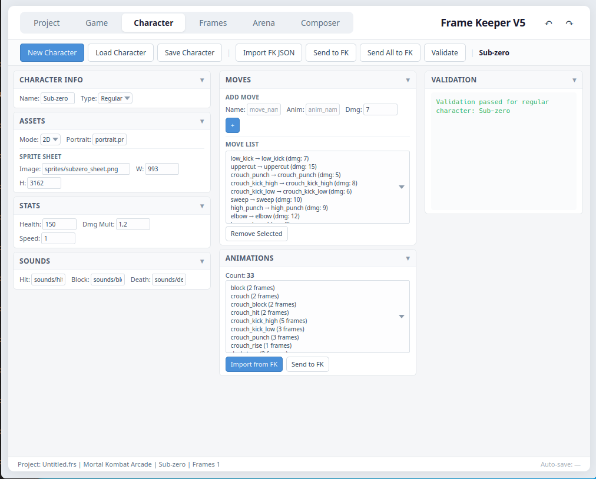
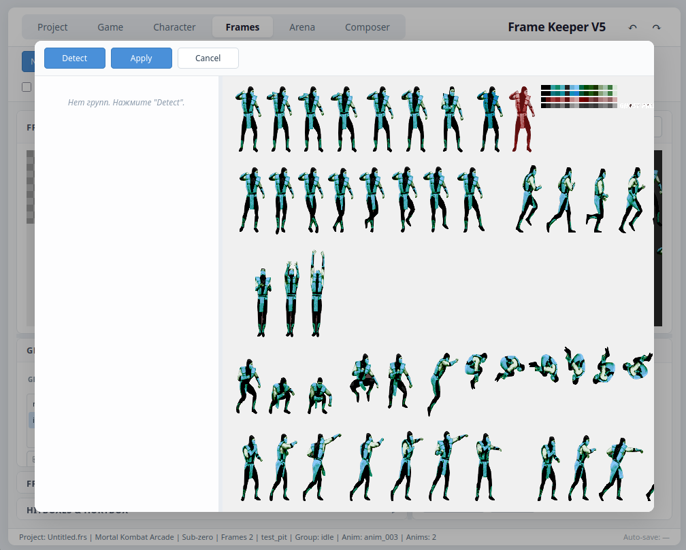
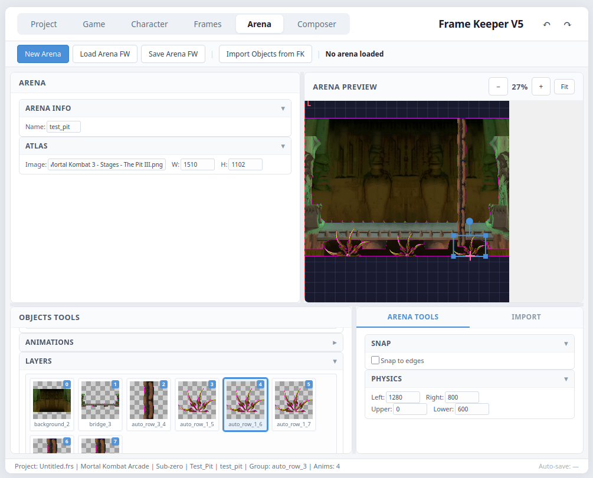
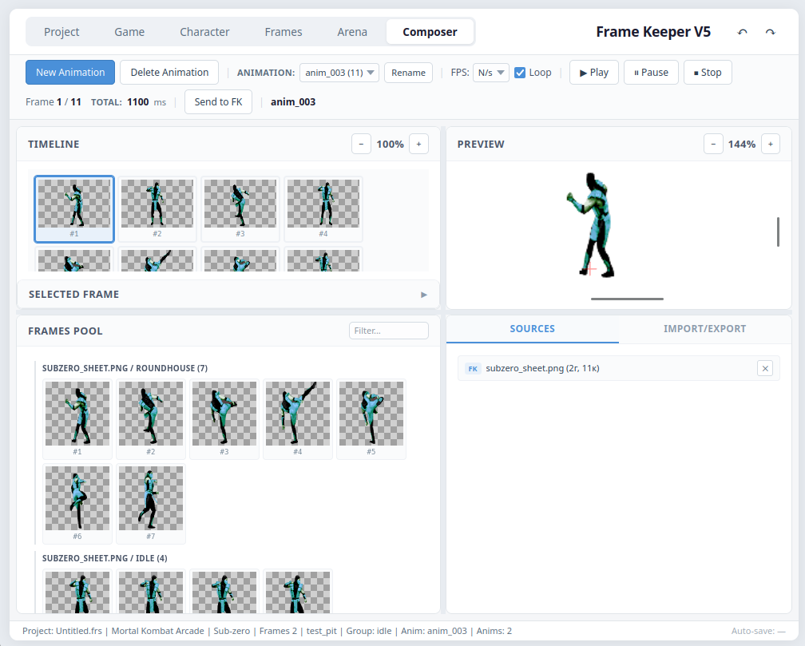
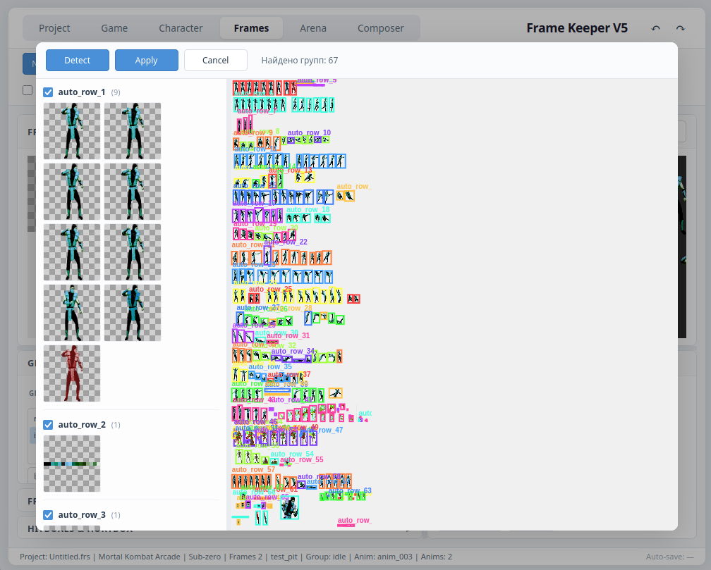

# Frame Keeper 5

**Визуальный редактор для 2D-файтингов на движке FREnC.**

Frame Keeper — это полноценный тулсет для создания 2D-файтингов: от нарезки спрайт-атласа до готовых `framework.lua` файлов для движка FREnC (на базе LÖVE2D). Работает как одностраничное веб-приложение на чистом JavaScript — без сборки, без Node.js, без зависимостей от сервера.


---

## Содержание

1. [Что это такое](#что-это-такое)
2. [Ключевые преимущества](#ключевые-преимущества)
3. [Пять вкладок — пять инструментов](#пять-вкладок--пять-инструментов)
   - [Project](#project--обзор-проекта)
   - [Game](#game--редактор-игры)
   - [Character](#character--редактор-персонажа)
   - [Frames](#frames--ядро-редактора)
   - [Arena](#arena--редактор-арен)
   - [Composer](#composer--редактор-анимаций)
4. [Установка и запуск](#установка-и-запуск)
5. [Форматы данных](#форматы-данных)
6. [Автоматический поиск спрайтов (Auto Detect)](#автоматический-поиск-спрайтов-auto-detect)
7. [Технические особенности](#технические-особенности)
8. [Известные ограничения](#известные-ограничения)
9. [Планы развития](#планы-развития)
10. [FAQ](#faq)

---

## Что это такое

**Frame Keeper 5** — визуальный редактор, который закрывает весь пайплайн разработки 2D-файтинга:

- **Нарезка атласа** на отдельные кадры и группы анимаций
- **Настройка точек привязки** (anchor, pivot) и **боксов** (hurtbox, pushbox, hitbox)
- **Сборка анимаций** в удобном редакторе с таймлайном
- **Редактирование арен** — слои, объекты, физика, камера
- **Экспорт** в формат FREnC (`framework.lua`) или универсальный JSON

Frame Keeper создан для проекта **FREnC** — движка файтингов на LÖVE2D, но вкладка **Frames** самодостаточна и может использоваться как универсальный редактор спрайт-атласов (совместима с TexturePacker-форматом JSON).



---

## Ключевые преимущества

### 🚀 Работает «из коробки» — без установки и сервера

Frame Keeper открывается **двойным кликом по `index.html`** — как обычный текстовый документ. Никаких:

- Установки через npm/yarn
- Запуска локального сервера
- Сборки Webpack/Vite
- Регистрации и лицензий

Скачал — открыл — работаешь.

### 📦 Zero dependencies

Никаких внешних библиотек и фреймворков. Только чистый JavaScript (ES6+), CSS и один минифицированный файл Split.js для разделителей панелей. Весь остальной код — собственный.

### 🎯 Полный пайплайн в одном приложении

Не нужно переключаться между Photoshop, TexturePacker, Tiled и файловым менеджером. От нарезки спрайта до готового `framework.lua` — всё в одном окне.

### 🌐 Универсальный JSON-экспорт

Помимо формата FREnC, Frame Keeper экспортирует спрайты в **JSON, совместимый с TexturePacker**. Это значит, что нарезанные спрайты можно использовать в **любом движке**: Godot, Unity, Phaser, Cocos, LÖVE, LibGDX.

### ⚡ Быстрая работа с большими атласами

Автоматический поиск спрайтов в один клик, эффективная модель viewport (zoom/pan/scroll) с сохранением контекста при работе с крупными PNG.

### 🧩 Специализация на файтинги

То, чего нет в массовых редакторах: полноценные hurtbox / pushbox / hitbox, раздельные anchor и pivot, `startup / active / recovery` для мувов, метка `floor` для арен.

---

## Пять вкладок — пять инструментов

### Project — обзор проекта

Центральная вкладка проекта. Содержит:

- **Project Info** — имя, описание, автор, целевой движок, версия формата, размер файла
- **Game, Characters, Arenas, Atlases** — сводная информация о проекте
- **Composer** — статистика по анимациям
- **Settings** — настройки проекта

Сверху — файловые операции: **New FKP**, **Open FKP**, **Save FKP**, **Save As...**, **Publish**.

В планах — единый файл проекта `.frs` (MessagePack) и `.frz` (ZIP-архив).

---

### Game — редактор игры



Редактор `framework.lua` игры — общие правила, применяемые ко всем персонажам.

**Секции:**

- **Game Info** — название, версия
- **Graphics** — окружение (2D/3D), камера, стиль HUD
- **Gameplay** — здоровье, время раунда, раунды для победы, тип блока, комбо, режимы игры, движение, прыжок, единицы измерения, камера, точки спавна
- **Character Definition** — список требуемых анимаций, мувов, звуков, спец-приёмов
- **Characters** — директория и список персонажей
- **Arenas** — директория и список арен, арена по умолчанию
- **Input** — привязки клавиш для Player 1 и Player 2

---

### Character — редактор персонажа



Редактор `framework.lua` персонажа.

**Секции:**

- **Character Info** — имя, тип (regular / boss)
- **Assets** — режим графики, портрет, спрайт-лист (image, width, height)
- **Stats** — здоровье, множитель урона, скорость
- **Sounds** — звуки удара, блока, смерти
- **Animations** — список анимаций с количеством кадров
- **Moves** — приёмы (имя, анимация, урон)
- **Validation** — результаты проверки на соответствие требованиям игры

**Интеграция с Frames:**

- **Import from FK** — забрать текущую анимацию из Frames
- **Send to FK** — отправить анимацию обратно в Frames для правки

---

### Frames — ядро редактора


Основной инструмент нарезки спрайт-атласа. Самодостаточный — может использоваться без FREnC.

**Основные области:**

#### Frame View (левая панель)
Просмотр текущего выбранного кадра с возможностью задать anchor / pivot / hurtbox / pushbox / hitbox.

#### Atlas View (правая панель)
Рабочая область с атласом. Показывает:

- Красную рамку выделения
- Зелёные линии-разделители между кадрами
- Жёлтые номера кадров
- Обводку всех кадров текущей группы

#### Group Control

Двухколоночный список групп и кадров:

- **Слева** — группы с количеством кадров
- **Справа** — кадры выбранной группы

**Возможности:**

- Множественное выделение кадров (Ctrl+клик / Shift+клик)
- Drag&drop кадров — реордер внутри группы и перенос между группами
- **Ctrl+drag** — копирование кадра вместо переноса
- Inline-переименование группы двойным кликом
- Inline-создание группы через `[+]`
- Копирование / удаление с подтверждением

#### Frame Customization

Настройка кадра:

- **Bounds** — координаты и размеры на атласе
- **Anchor** — точка привязки к сцене (в px и в относительных 0–1)
- **Pivot** — центр вращения и масштабирования
- **Duration** — длительность кадра

#### Hitboxes & Hurtbox

Полный редактор боксов файтинга:

- **Hurtbox (синий)** — зона, по которой бьют врага
- **Pushbox (зелёный)** — зона столкновения с противником
- **Hitboxes (красные)** — зоны, которыми бьёт персонаж (может быть несколько)

Все боксы редактируются мышью прямо на канвасе с угловыми маркерами.

#### Режимы выделения

- **Same width** — все кадры одинаковой ширины (для сеточных атласов)
- **Variable width** — кадры разной ширины (для анимаций)
- **Fixed boundaries** — внешние границы зафиксированы

#### Действия

- **Add Frame(s)** — добавить кадры из выделения в группу
- **Add Reversed** — добавить в обратном порядке
- **Replace** — заменить текущий кадр на выделенный

#### Auto Detect



Автоматический поиск спрайтов на атласе — отдельная подпанель с превью найденных групп. Подробнее в разделе [Автоматический поиск спрайтов](#автоматический-поиск-спрайтов-auto-detect).

#### Многопроектность

Работа с несколькими Frames-проектами параллельно. Переключение через выпадающий список в шапке Frames.

#### Экспорт

- **Export Standard** — JSON в формате Frame Keeper 5.0 (совместим с TexturePacker)
- **Export Full** — расширенный JSON с метаданными анимаций
- **Export Objects to Arena** — отправить группы в редактор арен
- **Export Groups to Composer** — отправить группы в редактор анимаций

---

### Arena — редактор арен



Визуальный редактор арен. Построен на модели **Objects Pool + Layers Scene**.

**Ключевая концепция:**

- **Objects** — пул объектов, приходящих из Frames или загруженных PNG. Хранят anchor, pivot, размеры — неизменяемо.
- **Layers** — размещение объектов на сцене. Каждый слой ссылается на объект из пула и добавляет свой трансформ.

Аналогия с Composer: Objects — это Pool, Layers — это Timeline.

#### Objects Pool

Сетка миниатюр объектов. Источники:

- **Import FK** — импорт всех групп активного Frames-проекта
- **Load PNG** — загрузка отдельного PNG-файла

#### Layers

Сетка миниатюр слоёв, отсортированных по Z (нижний слой — первый).

**Возможности:**

- Drag&drop объекта из Pool в Layers — создание слоя
- Drag&drop объекта из Pool **прямо в Preview** — создание слоя в точке drop
- Клик — выбор слоя
- Удаление с автоматической очисткой связанных ресурсов

#### Layer Properties

Полный XForm слоя:

- **Name** — имя
- **Object** — ссылка на объект из пула (read-only)
- **Pos X, Y** — позиция в world units (где anchor)
- **Scale X, Y** — масштаб
- **Rotation** — угол поворота
- **Z** — уровень по глубине
- **Floor** — метка пола (для FREnC)
- **Hidden** — скрыть слой в редакторе

#### Arena Preview

Полноценный визуальный редактор:

- Отрисовка слоёв в порядке Z
- **XForm** — position, scale, rotation вокруг pivot
- **Anchor** — точка прикрепления в мире (жёлтый крестик)
- **Pivot** — центр трансформации (розовый крестик)
- **Bounds** — красные пунктирные линии границ физики
- **Floor-подсветка** — зелёная обводка слоёв с меткой floor
- **Сетка мира** с осями X/Y
- **Auto-fit** — кнопка вписать мир в экран
- **Zoom, pan** — через СКМ и Ctrl+Wheel

**Мышь:**

- Клик по слою → выбор
- Drag внутри слоя → перемещение (с **snap** к краям соседних слоёв, к bounds и к осям мира)
- Drag за угловые маркеры → **scale**
- Drag за rotation-маркер → **rotation**
- Drag за bounds-линию → изменение границ физики

#### Экспорт

**Save Arena FW** — генерирует `framework.lua` арены, готовый для FREnC.

---

### Composer — редактор анимаций



WYSIWYG-редактор анимаций из отдельных кадров.

**Раскладка:**

- **Timeline** — горизонтальная полоса с миниатюрами кадров анимации
- **Preview** — холст 1024×1024 с anchor-выравниванием кадра по центру
- **Frames Pool** — пул кадров из источников
- **Sources / Import-Export** — источники и экспорт

**Возможности:**

- Drag&drop кадров из Pool в Timeline
- Реордер кадров внутри Timeline
- Многострочная раскладка Timeline
- Настройка длительности кадра
- Zoom Pool и Timeline через Ctrl+Wheel
- Фильтр кадров по имени группы / источника

**Play/Pause/Stop** — проигрывание анимации с настройкой FPS, loop и реверс.

**Экспорт:**

- **Send to FK** — отправить все анимации обратно в Frames
- **Export to JSON** — файл JSON
- **Export to Lua** — файл Lua

---

## Установка и запуск

### Требования

- Любой современный браузер: **Chrome, Edge, Firefox, Safari, Opera**
- Ничего больше — никаких установок, серверов, зависимостей

### Запуск

1. Скачайте папку `Frame Keeper 5/`
2. Откройте **`index.html`** двойным кликом
3. Работайте

**Всё.**

Приложение работает по концепции `file://` — не требует локального сервера и не обращается к интернету.

### Структура проекта

```
Frame Keeper 5/
├── index.html
├── css/       — модульные CSS-файлы
├── js/        — исходный код
├── lib/       — Split.js
└── pics/      — ресурсы
```

---

## Форматы данных

Frame Keeper работает с четырьмя форматами:

### 1. `framework.lua` (FREnC)

Родной формат движка. Используется на вкладках **Game, Character, Arena**.

### 2. JSON Frame Keeper 5.0

Универсальный формат экспорта из Frames. Совместим с TexturePacker.

**Особенности:**

- Расширения `anchor` и `pivot` — TexturePacker их игнорирует
- Боксы (`hurtBox`, `pushBox`, `hitBoxes`) сохраняются в JSON
- `duration` кадров — в миллисекундах

### 3. `.frs` — проект Frame Keeper

Единый файл проекта (в разработке). Формат MessagePack. Содержит **все данные проекта**: атласы (ссылки), группы кадров, персонажей, арены, анимации Composer, настройки.

### 4. `.frz` — упакованный проект

ZIP-архив `.frs` + все атласы. Для переноса и бэкапов.

---

## Автоматический поиск спрайтов (Auto Detect)



Одна из ключевых фишек Frame Keeper. Позволяет **автоматически найти все спрайты на атласе** — за один клик.

### Как работает

**Алгоритм SpriteDetector:**

1. **Определение цвета фона** — по 4 углам атласа (если ≥3 совпадают)
2. **Маска содержимого** — все непрозрачные пиксели, отличающиеся от фона
3. **Компоненты связности** — поиск изолированных спрайтов
4. **Кластеризация по строкам** — спрайты одной строки группируются
5. **Подгруппы по высоте** — спрайты разного размера выделяются отдельно
6. **Автоименование** — `auto_row_1`, `auto_row_2`, ...

### Пайплайн

1. **Load PNG** — загрузить атлас
2. (Опционально) **Pick BG** — пипеткой указать цвет фона, если он не прозрачный
3. **Auto Detect** — открыть оверлей
4. **Detect** — найти спрайты
5. Снять галочки с ненужных групп
6. **Apply** — создать группы в Frames

### Визуальная часть

- Слева — сетка миниатюр найденных групп
- Справа — атлас с цветной обводкой найденных спрайтов
- Пользователь визуально проверяет результат **до** подтверждения

---

## Технические особенности

### Концепция `file://`

Frame Keeper — **настоящее SPA без сервера**. Это накладывает ограничения, которые мы сознательно приняли:

- ❌ **Web Worker запрещён** — `new Worker()` не работает на `file://`. Все вычисления синхронны.
- ❌ **`fetch` для локальных файлов запрещён**
- ❌ **ES-модули (`import/export`) не используются** — только глобальные классы через `window.*`
- ✅ Всё работает на чистом JavaScript и одном `<canvas>`

### Архитектура

**11 контроллеров** разделяют ядро `App.js`:

- `AnimationPlayer` — проигрывание анимаций
- `AtlasMouseController` — мышь на атласе
- `AutoDetectUI` — оверлей Auto Detect
- `BoxesController` — hurtbox / pushbox / hitboxes
- `EventListeners` — все DOM-подписки
- `FileController` — загрузка файлов
- `FrameMouseController` — мышь на канвасе кадра
- `GroupControl` — двухколоночный UI групп
- `JsonEditorUI` — JSON-редактор
- `TooltipManager` — тултипы

**Ключевые переиспользуемые модули:**

- **`CanvasViewport`** — единая модель zoom/pan/scroll для всех канвасов
- **`SelectionModel`** — модель выделения атласа (3 режима: same, variable, fixed)
- **`SpriteDetector`** — синхронный алгоритм поиска спрайтов
- **`Split.js`** — разделители панелей

### Производительность

- **Diff-обновление DOM** — перерисовываются только изменённые элементы
- **rAF-батчинг** — батчинг перерисовок через `requestAnimationFrame`
- **Оптимизация под большие атласы** — работа с атласами на сотни кадров

---

## Известные ограничения

Frame Keeper находится в активной разработке. Открытые задачи:

- **Многопроектность Character** — сейчас один персонаж за раз (в планах — список в `.frs`)
- **Многопроектность Arena** — сейчас одна арена за раз
- **Виртуализация списков** — при более 200 кадров в группе производительность может снизиться
- **Camera-инструмент** — отдельная секция в Arena (в планах)
- **Серво-обёртка** — изолированный бэкенд для standalone-режима (в планах)

---

## Планы развития

### Ближайшее

- **Формат `.frs`** — единый файл проекта (MessagePack)
- **Формат `.frz`** — ZIP-упаковка проекта с атласами
- **Auto-save** — автоматическое сохранение в IndexedDB
- **Publish для FREnC** — упакованные данные вместо разрозненных `framework.lua`

### Средний срок

- **Многопрофильность** Character и Arena
- **Camera-инструмент** с In-game View
- **Валидация арен** — проверка floor-слоёв, bounds, атласа
- **Модульные импортёры** — MUGEN, Godot, Phaser

### Дальний срок

- **Frame Keeper на Servo** — standalone-приложение с обфускацией кода
- **Flashback 1992** — оптимизация Frames под сотни кадров
- **Docking панелей** — перетаскивание панелей между колонками

---

## FAQ

### Можно ли использовать Frame Keeper для не-FREnC проектов?

Да. Вкладка **Frames** самодостаточна. Экспорт JSON совместим с TexturePacker — поддерживается большинством 2D-движков.

### Как нарезать атлас с прозрачным фоном?

Просто: `Load PNG` → `Auto Detect` → `Detect` → `Apply`. Прозрачный фон определяется автоматически.

### Как нарезать атлас с цветным фоном?

`Load PNG` → `Pick BG` → клик по фону → `Auto Detect` → `Detect` → `Apply`.

### Работает ли Frame Keeper на сервере?

Frame Keeper **не требует** сервера. Он работает на `file://` — двойным кликом. Если сервер есть — тоже работает, но это не обязательно.

### Что делать с большим атласом?

Auto Detect работает за доли секунды на атласах до 1024×1024. Для более крупных — рекомендуем работать группами.

### Сохраняет ли Frame Keeper мою работу автоматически?

Пока нет. В разработке — auto-save в IndexedDB (восстановление после падения браузера) и формат `.frs` для полноценного сохранения проекта.

### Почему не Electron?

Концепция `file://` — осознанный выбор. Frame Keeper открывается как обычный HTML-файл. В будущем — обёртка на движке **Servo** для standalone-приложения с обфускацией кода.

---

## Лицензия

Frame Keeper 5 разрабатывается как часть проекта FREnC. Подробности — в репозитории проекта.

---

## Благодарности

- **LÖVE2D** — движок, на котором работает FREnC
- **Split.js** — разделители панелей

---
